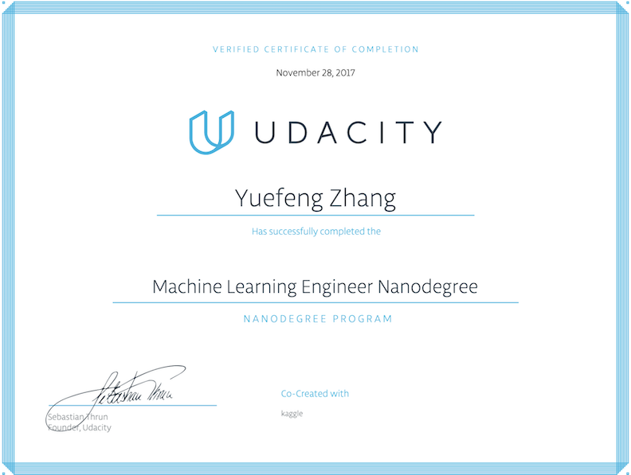
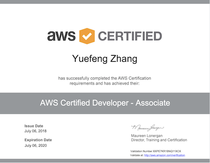

# Selected List of Publications on Data Science

### Also see my [Web site](https://yzzhang.github.io/) for details.

### 1. Deep Learning

#### 1.1 Deep Clustering for Financial Market Segmentation
See publication: [A deep learning approach for credit card customer clustering, Towards Data Science, Nov 23, 2019](https://medium.com/@zhangyuefeng1/deep-clustering-for-financial-market-segmentation-2a41573618cf?sk=a3f7a7e5d21f0ef47b2167ce3f0d0cb6)

#### 1.2 Deep Multi-Input Models Transfer Learning for Image and Word Tag Recognition
See publication: [A multi-models deep learning approach for image and text understanding, Towards Data Science, Nov 20, 2019](https://towardsdatascience.com/deep-multi-input-models-transfer-learning-for-image-and-word-tag-recognition-7ae0462253dc)

#### 1.3 Deep Learning for Natural Language Processing Using word2vec-keras
See publication: [A deep learning approach for NLP by combining Word2Vec with Keras LSTM, Towards Data Science, Nov 3, 2019](https://towardsdatascience.com/deep-learning-for-natural-language-processing-using-word2vec-keras-d9a240c7bb9d)

#### 1.4 Deep Learning in Winonsin Breast Cancer Diagnosis
See publication: [A deep learning approach for healthcare, Towards Data Science, Oct 30, 2019](https://towardsdatascience.com/deep-learning-in-winonsin-breast-cancer-diagnosis-6bab13838abd)

### 2. Machine Learning

#### 2.1 Python Data Preprocessing Using Pandas DataFrame, Spark DataFrame, and Koalas DataFrame
See publication: [Preparing data for machine learning in Python, Towards Data Science, Oct 14, 2019](https://towardsdatascience.com/python-data-preprocessing-using-pandas-dataframe-spark-dataframe-and-koalas-dataframe-e44c42258a8f)

#### 2.2 Object-Oriented Machine Learning Pipeline with mlflow for Pandas and Koalas DataFrames
See publication: [End-to-end process of developing Spark-enabled machine learning pipeline in Python using Pandas, Koalas, scikit-learn, and mlflow, Towards Data Science, Oct 24, 2019](https://towardsdatascience.com/object-oriented-machine-learning-pipeline-with-mlflow-for-pandas-and-koalas-dataframes-ef8517d39a12)

#### 2.3 Automatic Machine Learning in Fraud Detection Using H2O AutoML
See publication: [Machine Learning Automation in Finance, Towards Data Science, Nov 13, 2019](https://towardsdatascience.com/automatic-machine-learning-in-fraud-detection-using-h2o-automl-6ba5cbf5c79b)

## Certificates

* [Udacity Machine Learning Engineer Nanodegree](https://github.com/yzzhang/machine-learning/blob/master/certificates/Yuefeng_certificate_11_28_2017.pdf)

* [AWS Certified Solutions Architect - Associate](https://github.com/yzzhang/machine-learning/blob/master/certificates/AWS_Certified_Solutions_Architect_Associate_certificate.pdf)

* [AWS Certified Developer - Associate](https://github.com/yzzhang/machine-learning/blob/master/certificates/AWS_Certified_Developer_Associate_Certificate.pdf)

